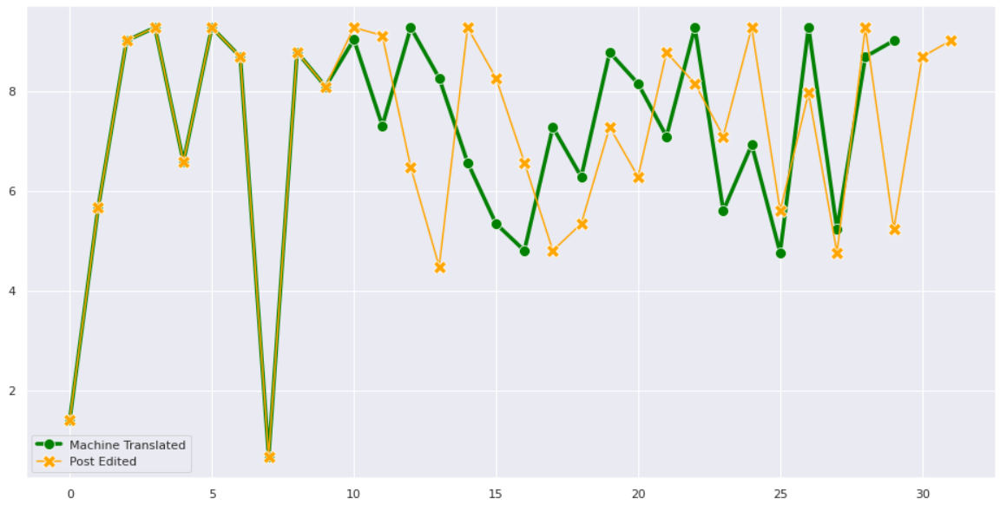

# Test-Edits

#### Visualizing the Machine Translated and Post-Edited Sentences using the Respective Word Vector(Normalized).

This Repository contains the Apertium Machine Translated Sentences, and the Google, Microsoft, Yandex Machine Translated Sentences for English-Spanish Pair. Along with that, it also contains the Human Post-Edited sentences, as improvements for the MT tool.

The code in the Jupyter Notebooks: 

[**Apertium_Test-Edits.ipynb**]: Apertium_Test-Edits.ipynb	"Apertium Test-Edits"

tries best to represent the difference between the Machine Translated and the Post-Edited sentences. 

[**Google_Test-Edits.ipynb**]: Google_Test-Edits.ipynb	"Google Test-Edits"

 is a measure to show the same but between the Google Translate and the Post-Edited.

The Analysis of each is done in the respective Notebooks.

The JSON Data is in the Data Folder.

## Approach

At first the sentences were converted into Word Embeddings (for each word) using spaCy's built in Word2Vector Algorithm (that uses Glove Vectors) and then it was normalized using the `vector_norm`

method which either uses t-SNE or LDA for normalization of High Dimension Data(50 Incase of Spanish Glove Vectors, and 300 for English).

This was then plotted against each other to represent the difference in translations.

## Results

Sentence: (English to Spanish Conversion)

**English**: García was born on 19 April 1981 in Pamplona, and is from the Navarre region of Spain. Her father practiced karate but because of her vision problems, she was unable to follow him in the sport.

**Apertium Spanish Translated**: García nació el 19 de abril de 1981 en Pamplona, y es del Navarre región de España.Su padre kárate practicado pero debido a sus problemas de visión, sea incapaz de seguirle en el deporte.

**Post-Edited**: García nació el 19 de abril de 1981 en Pamplona, y es de la comunidad Navarra de España. Su padre practicaba kárate pero debido a sus problemas de visión, fue incapaz de seguirle en el deporte.

##### Apertium Translated Sentence (in Green with Round-Markers) vs. Post-Edited (in Yellow with Cross Markers)

The plots where the post-edited points and Machine Translated points overlap are perfect/accurate translations for the sentence. But the points where the sentences do not overlap or show huge convergence and distance, are the changes in structure of the sentence.

This can be due to the following reasons:

- Translation Accuracy

- Change of semantic structure of the sentence by the Post-Editor to fit the context

And can be improved by finding the appropriate dictionary elements(monodox, bidix) and coming up with an accurate learning algorithm to approach this. One thing to notice is, only those words/phrases are to be identified where the convergence is high or the distance is big enough to notice the change in structure of the algorithm.

###### Why Have I chosen to visualize data instead of just showing the accuracy measures?

The approach will take the same measure, instead of using spacy's normalized vector rather I'll use the whole 50 Dimensional data to compute an appropriate distance to get the word difference.

### Requirements 🛠

spacy (and english, spanish data)

pandas

matplotlib

seaborn

numpy 

